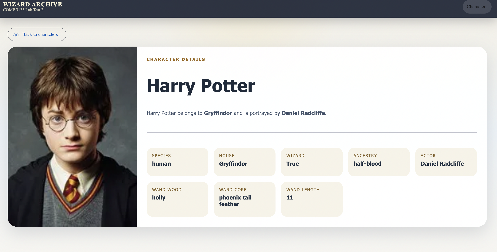

# 101491193-lab-test2-comp3133

## App Description
This project is an Angular application built for COMP 3133 Lab Test 2 using a Harry Potter theme. It consumes the public Harry Potter API and presents a styled interface for browsing characters, filtering them by house, and viewing detailed information for a selected character.

The app is implemented with Angular standalone components, Angular Router, Angular Material, and a dedicated service layer for API communication.

## Features Implemented
- Display a full character list using the Harry Potter API.
- Show key fields for each character, including `name`, `house`, and `image`.
- Filter characters by house using a dropdown component.
- Support characters with no house using a dedicated `No House` filter.
- Open a character details page using route parameters.
- Display required detailed fields:
  `name`, `species`, `house`, `wizard`, `ancestry`, `wand.wood`, `wand.core`, `wand.length`, `actor`, and `image`.
- Use Angular Material components for layout and interface styling.
- Deploy the application to Vercel for public access.

## Tech Stack
- Angular 21
- Angular Material
- TypeScript
- SCSS
- Harry Potter API: `https://hp-api.onrender.com/`

## Live Demo
- Vercel: `https://101491193-lab-test2-comp3133.vercel.app`

## Screenshots

### 1. Character List - All Houses
This screen shows the default character list page with all available Harry Potter characters.


### 2. Character List - Gryffindor Filter
This screen shows the house filter in action by displaying only Gryffindor characters.


### 3. Character List - No House Filter
This screen shows characters who do not belong to any house.


### 4. Character Details
This screen shows the details page for Harry Potter, including the required detailed fields and wand information.



## Instructions To Run The Project

### 1. Clone the repository
```bash
git clone https://github.com/91MLP/101491193-lab-test2-comp3133.git
cd 101491193-lab-test2-comp3133
```

### 2. Use Node.js 22
This project is configured for Node.js 22.

```bash
nvm use
```

If Node 22 is not installed yet:

```bash
nvm install 22
nvm use 22
```

### 3. Install dependencies
```bash
npm install
```

### 4. Start the development server
```bash
npm start
```

Then open:

```text
http://localhost:4200
```

### 5. Build for production
```bash
npm run build
```

## Project Structure
```text
src/app/
  components/
    character-filter/
    character-list/
    character-details/
  models/
  services/
```

## API Endpoints Used
- All characters: `https://hp-api.onrender.com/api/characters`
- Characters by house: `https://hp-api.onrender.com/api/characters/house/:house`
- Character details by id: `https://hp-api.onrender.com/api/character/:id`
